<!-- 🌊 Animated Header -->
---

### ✨ Quote of the Day
<blockquote>
<!-- QUOTE:START -->
“Code is like humor. When you have to explain it, it’s bad.” — Cory House
<!-- QUOTE:END -->
</blockquote>

---

### 🎧 Now Playing (Spotify)

<!-- Replace YOUR_SPOTIFY_UID below and optionally self-host, or keep as-is if you set up the action -->
<a href="https://open.spotify.com/user/313kfxw7oviibu2joldqfimuvxly?si=ef16c2e29ef34fb6">
  ### 🎶 Now Playing on Spotify
  

    
  

---

### 🖼️ 3D Contribution Graph

---

### 📊 Metrics Dashboard

---

<!-- 🌌 Contribution Graph -->

---

### 😂 Dev Joke of the Day

---

<!-- 🏆 Achievements -->
### 🏆 My GitHub Achievements

---

<!-- 🐍 Snake Contribution Animation -->

---

<!-- 🌊 Animated Footer -->

